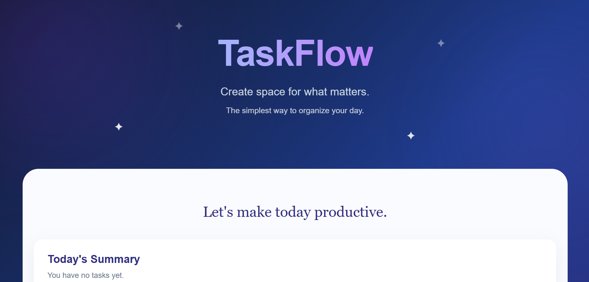

# 📝 TaskFlow – To-Do Web Application

A clean and responsive To-Do Web Application built using **HTML**, **CSS**, and **Vanilla JavaScript**. TaskFlow helps users organize their daily activities by allowing them to add, edit, complete, and delete tasks with a modern and minimal user interface.

---

## 📸 Preview



---

## 🚀 Live Demo

🔗 **Live Website:** https://your-github-pages-link

---

## ✨ Features

- Add new tasks instantly
- Edit existing tasks
- Delete tasks
- Mark tasks as completed
-  Separate Pending and Completed task lists
-  Live task counters
-  Dynamic "Today's Summary"
-  Data persistence using Local Storage
-  Fully responsive design
-  Smooth hover effects and animations


---

## 🛠️ Built With

- HTML5
- CSS3
- JavaScript (Vanilla)
- Local Storage API

---

## 📂 Project Structure

```
WebDev-L2-Todo/
│
├── index.html
├── style.css
├── script.js
├── README.md
└── images/
    └── taskflow-preview.png
```

---

##  How It Works

### Add Tasks
Enter a task in the input field and click **Add Task**.

### Complete Tasks
Click the ✓ button to move a task to the Completed section.

### Edit Tasks
Click the ✏️ button to modify an existing task.

### Delete Tasks
Click the 🗑️ button to permanently remove a task.

### Local Storage
All tasks are automatically saved in the browser, so they remain available even after refreshing the page.

---

##  Design Highlights

- Modern blue-purple gradient hero section
- Gradient typography
- Rounded cards with soft shadows
- Clean and minimal layout
- Responsive design for desktop, tablet, and mobile
- Subtle floating sparkle animations

---

##  Responsive Design

TaskFlow is optimized for:

-  Desktop
- Mobile
- Tablet

---

## 📌 Future Improvements

- Drag and Drop task sorting
- Due dates and reminders
- Task categories
- Search and filter tasks
- Dark/Light mode toggle
- Priority labels

---

## 👩‍💻 Author

**Chandana T. D.**

GitHub: https://github.com/chandanatd495-ctd 


