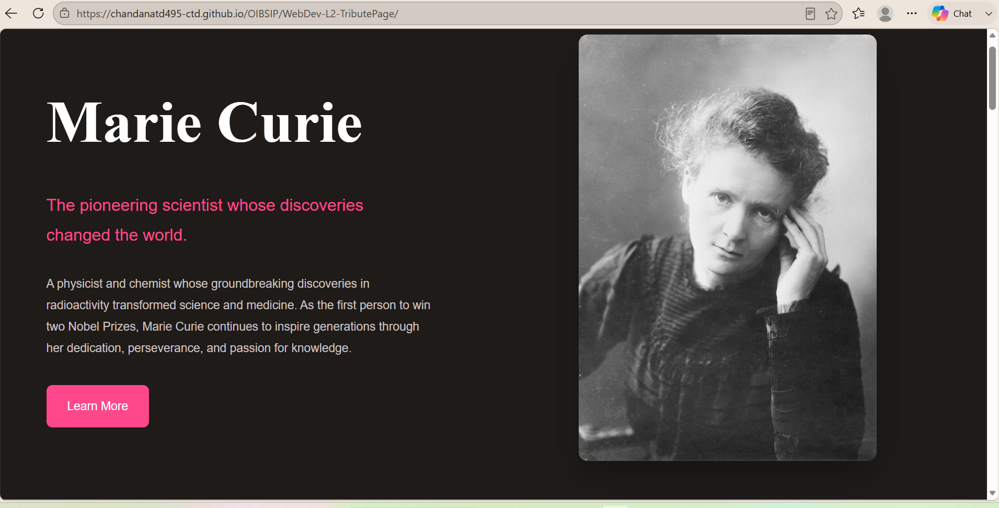

# Marie Curie Tribute Page

A responsive tribute page dedicated to **Marie Curie**, one of the greatest scientists in history. This project was created as **Task 2** for the **Oasis Infobyte Web Development and Designing Internship (OIBSIP)** using HTML and CSS.

---

##  About the Project

This tribute page celebrates the life, achievements, and lasting legacy of Marie Curie. The website presents her inspiring journey through a clean, modern, and responsive design while highlighting her contributions to science and medicine.

---

##  Features

- Responsive design for desktop and mobile devices
- Elegant hero section with a featured image
- Biography section with original paraphrased content
- Timeline of major life events and achievements
- Inspirational quote section
- Legacy section with achievement cards
- Modern card layouts and subtle hover effects

---

##  Technologies Used

- HTML5
- CSS3


---

##  Project Structure

```
WedDev-L2-TributePage/
│── index.html
│── style.css
│── README.md
└── images
└── Task2(video)

```

---

##  Preview




---

##  Live Demo

GitHub Pages Link:
https://chandanatd495-ctd.github.io/OIBSIP/WebDev-L2-TributePage/

---

##  Acknowledgements

- Information researched from **Wikipedia** and **Britannica** (paraphrased into original content)
- Images sourced from **Wikimedia Commons**

---

## Author

**Chandana T D**

GitHub: 
https://github.com/chandanatd495-ctd 
---
